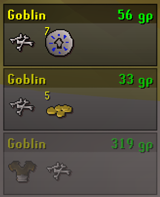
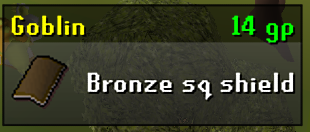
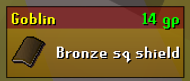

# Loot HUD Plugin

A comprehensive loot tracking overlay  that displays recent loot drops in a customizable, movable HUD overlay.

---

## Features

### Smart Loot Display
- Real-time loot notifications from:
    - NPC kills
    - Player kills
    - Pickpocketing
    - Game events
- Configurable display duration (1–60 seconds)
- Multiple simultaneous entries (1–10)
- Smooth fade-out transitions for older entries

---

### Complete Visual Customization
- Fully customizable colors and transparency
- Adjustable background and border opacity
- Resizable, draggable overlay with screen-edge snapping
- Item icon display with grid layout control
- Source-type icons:
    - NPC
    - Player
    - Pickpocket
    - Event

---

### Advanced Filtering System
- Filter loot by source type:
    - NPC
    - Player
    - Pickpocket
    - Event
- Minimum value threshold filtering
- Ignored items list (e.g. bones, junk loot)
- Substring-based item matching for flexible filtering

---

### Rare Item Highlighting
- Multiple highlight effects:
    - Static
    - Pulse (Breathing)
    - Rainbow animation
- Configurable rare item list by name
- Value-based highlight thresholds
- Custom highlight colors and animation speeds
- **Note:** Highlights apply only to individual (non-grouped) entries

---

### Smart Grouping System
- Group multiple kills from the same source into a single entry
- Configurable kill-count display threshold
- Optional reset of grouped data on logout
- Seamless switching between grouped and individual display modes

---

## 📸 Screenshots

